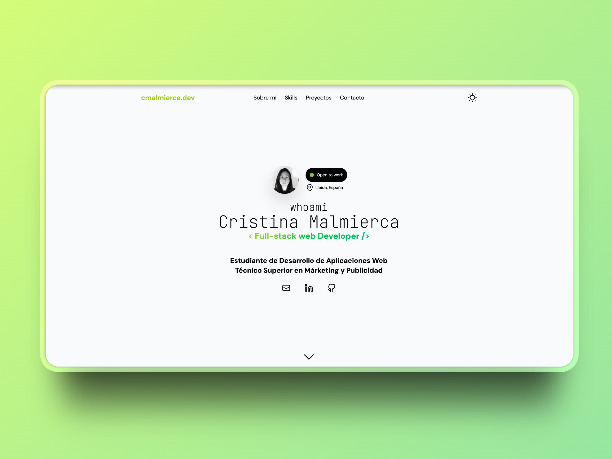

# Portfolio de Cristina Malmierca

Este es mi portfolio personal donde muestro mis proyectos.
Está desarrollado usando **Astro**, desplegado en **Vercel**, con animaciones de **Anime.js** e iconos de **Lucide / Iconify**.

---

## Tecnologías utilizadas

- **Framework / Static Site Generator:** Astro (MIT)
- **Hosting / Despliegue:** Vercel  
- **Animaciones:** Anime.js  (MIT)
- **Iconos:** Lucide Icons (ISC/MIT) y Iconify / Astro Icons y Heroicons

## Iconos utilizados

Este proyecto utiliza los siguientes iconos:

- **Lucide Icons** ([https://lucide.dev](https://lucide.dev))  
    - Licencia ISC, con partes derivadas de Feather bajo MIT.
    - Se utiliza para importar y manejar los iconos de forma sencilla en el proyecto.
- **Astro Icons / Iconify** ([https://iconify.design](https://iconify.design))  
      - Licencia MIT.
    - Se utiliza para importar y manejar los iconos de forma sencilla en el proyecto.
- **Heroicons** ([https://heroicons.com/](https://heroicons.com/))  
    - Licencia MIT.
    - Solo se usan los iconos SVG directamente.
    

Se conservan los avisos de copyright originales de los autores.  
Para más detalles, consulta los archivos en `licenses/`.
